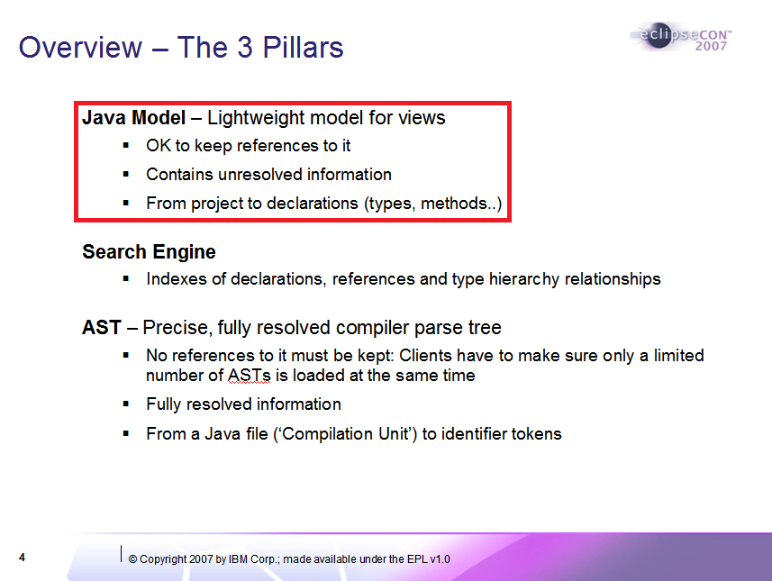
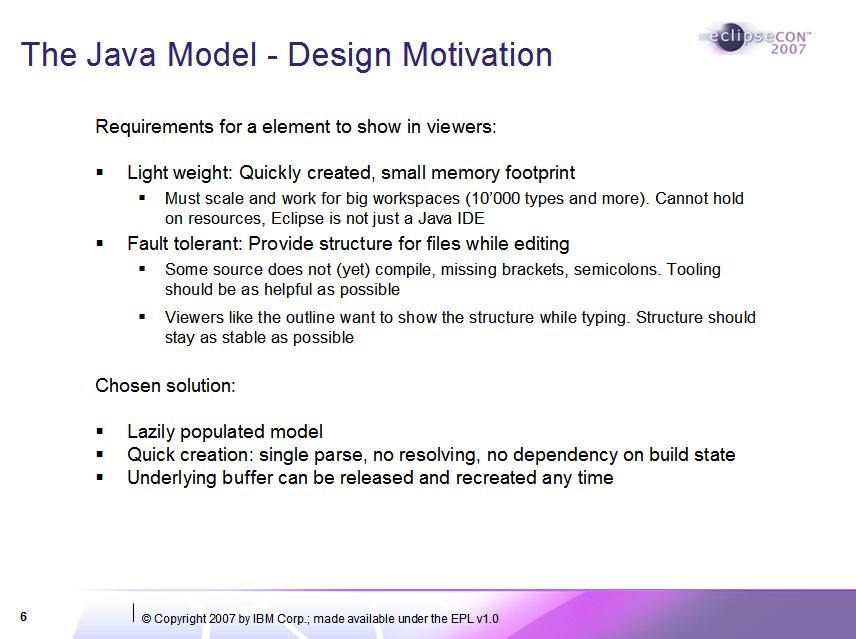
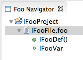

# Handly
[eclipse.org/handly](http://eclipse.org/handly/)
 
 
Vladimir Piskarev, 1C
 
December 2015

## What is Handly?
* At its core, a class library for handle-based models
* Special emphasis on code-centric models of Eclipse workspace
* Similar in design patterns and principles to JDT Java model
* A set of bricks rather than an all-encompassing IDE framework

## Handle-based models are all around us
* Workspace resource model
  * Programming language agnostic
* Language-specific models on top of the resource model
  * A basis for JDT, CDT, etc.
  * Define a code-centric view on the workspace
  * Support navigation down to structural elements inside source files

### Example: JDT Java model

### Example: JDT Java model

## A problem
* As the saying goes,
> **Every Eclipse IDE worth it salt starts as a JDT fork**
* Is it really a problem?
* I think so, along with many others

### [Bug 415563](https://bugs.eclipse.org/bugs/show_bug.cgi?id=415563) - Move generic parts of JDT to (D)LTK
* Reported: 2013-08-21 by Mickael Istria
* Comment 3 by Doug Schaefer:
> [I'm not totally sold that simply copying the JDT
was the right thing for DLTK. And JSDT for that matter
which also copied JDT and even left most of the classnames
the same. I think we need a deeper introspection on what a
common language infrastructure should include...](https://bugs.eclipse.org/bugs/show_bug.cgi?id=415563#c3)

### [Bug 36939](https://bugs.eclipse.org/bugs/show_bug.cgi?id=36939) - Improve support for Java-like source files
* Reported: 2003-04-25 by Jim des Rivieres
* 84 comments, 65 users on CC List, 52 votes so far
* Comment 53 by Philipe Mulet (2008-10-23):
> [And maybe the real solution lives elsewhere,
like having a separate generic model where
the Java model would be an instance of it...](https://bugs.eclipse.org/bugs/show_bug.cgi?id=36939#c53)

## Enter Handly

### Basically, we had a look at this:

### ...and generalized it to this:

### Basic interfaces and skeletal implementations

### Example: A simple model

### Example: A Handly-based Java model

### Source Element

### Source File

### Change notifications

## Design goals
* Conceptual parsimony
  * Try to distill truly fundamental abstractions
* Flexibility
  * No restrictions on the shape of attainable models
  * No dependency on a specific parsing technology
  * The model implementor remains fully in charge

## Design goals
* The API should be rich enough to enable such features as:
  * Model change notifications
  * Comprehensive working copy support
  * Integration with source editors (incl. Xtext editor)
  * Common UI frameworks (Outline, Working Set, Search...)

## Design details
* Please see [System Overview](http://www.eclipse.org/downloads/download.php?file=/handly/docs/handly-overview.pdf&r=1)
for more details
* Written in early 2014, but still relevant

## Current status
* About two years in development at Eclipse
* Successfully used in two commercial products
  * Adopters (1C and Codasip) seem happy so far
* [erlide](http://erlide.org) is in the process of adopting
* A number of exemplary implementations
  * Including a [Java model example](https://pisv.wordpress.com/2015/06/22/handly-0-3-java-model-example/)
* Comprehensive [getting started guide](https://github.com/pisv/gethandly/wiki)

## Current status
* Version 0.4
  * Many significant API improvements
  * Model adaptation facility
* Would like to finalize core API within 0.5 (Neon)
  * It's about time!

## The problem: lack of broader community feedback
Constructive criticism is essential before we can really finalize the API

## How to involve Eclipse IDE community?
* That is the question
* A tough one, if history is any guide...

## Development Tools Factorization
Apparently a long-standing problem in Eclipse
> [Long time ago in 2005 we tried to find/build a common ground.
That effort died for several reasons: complexity, existing code worked,
focus on new features more important for projects, lack of resources, ....
-- Dani Megert](https://bugs.eclipse.org/bugs/show_bug.cgi?id=415563#c4)

## But how to involve Eclipse IDE community?
I don't know. But I believe that:
* The factorization problem is important
* It will become increasingly important as more \*DT projects are created.
Eclipse is not just a Java IDE
* This puzzle can only be solved together
* Handly might serve as a first piece, in some way or another

## Thank you!
Any help or feedback would be greatly appreciated!
