# Handly
[eclipse.org/handly](http://eclipse.org/handly/)
 
 
Vladimir Piskarev, 1C
 
December 2016

## What is Handly?
* At its core, a class library for handle-based models
* Special emphasis on code-centric models of Eclipse workspace
* An underpinning for Eclipse-based development tools

## Background

## Handle-based models in the Eclipse IDE
* Workspace resource model
  * Programming language agnostic
* Language-specific models on top of the resource model
  * Define a code-centric view on the workspace
  * Support navigation down to structural elements inside source files
  * Examples: the Java model of Eclipse Java development tools (JDT),
    the C model of Eclipse C/C++ Development Tooling (CDT), etc.

### Example: JDT Java model
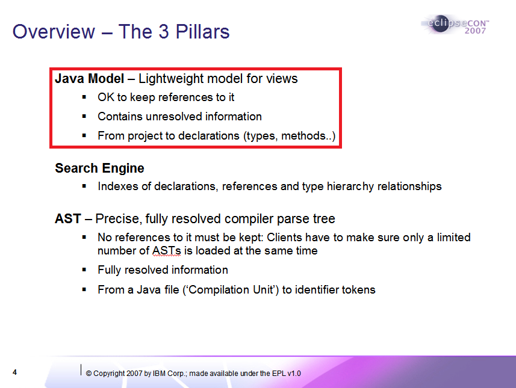

### Example: JDT Java model
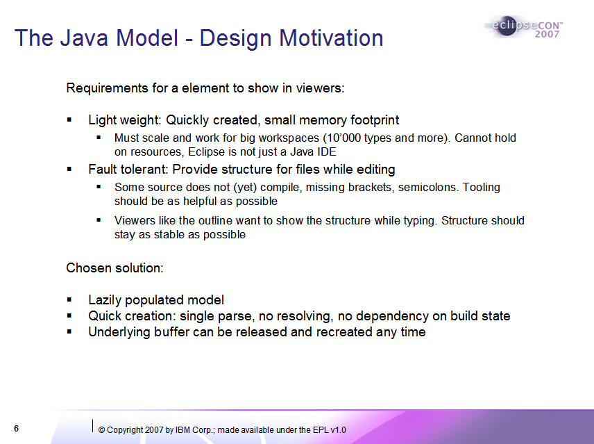

## Development Tools Factorization
Apparently a long-standing problem in Eclipse
> [Long time ago in 2005 we tried to find/build a common ground.
That effort died for several reasons: complexity, existing code worked,
focus on new features more important for projects, lack of resources, ....
-- Dani Megert](https://bugs.eclipse.org/bugs/show_bug.cgi?id=415563#c4)

### Eclipse Language Symposium (Ottawa, October 2005)
'A Seed for an Eclipse Language Toolkit' (Position paper by Martin Aeschlimann)
> [The approach taken when implementing this CDT prototype was to follow
the concepts and structure of the JDT plug-in... there were parts that had
to be copied; most notably the language model infrastructure... resulting in
the desire that Eclipse should provide a common infrastructure for language
models...](https://www.eclipse.org/org/langsymp/position_paper_martin_aeschlimann.html)

### [Bug 415563](https://bugs.eclipse.org/bugs/show_bug.cgi?id=415563) - Move generic parts of JDT to (D)LTK
* Reported: 2013-08-21 by Mickael Istria
* Comment 3 by Doug Schaefer:
> [I'm not totally sold that simply copying the JDT
was the right thing for DLTK. And JSDT for that matter
which also copied JDT and even left most of the classnames
the same. I think we need a deeper introspection on what a
common language infrastructure should include...](https://bugs.eclipse.org/bugs/show_bug.cgi?id=415563#c3)

### [Bug 36939](https://bugs.eclipse.org/bugs/show_bug.cgi?id=36939) - Improve support for Java-like source files
* Reported: 2003-04-25 by Jim des Rivieres
* Comment 53 by Philipe Mulet (2008-10-23):
> [And maybe the real solution lives elsewhere,
like having a separate generic model where
the Java model would be an instance of it...](https://bugs.eclipse.org/bugs/show_bug.cgi?id=36939#c53)

## Enter Handly

### Basically, we had a look at this:
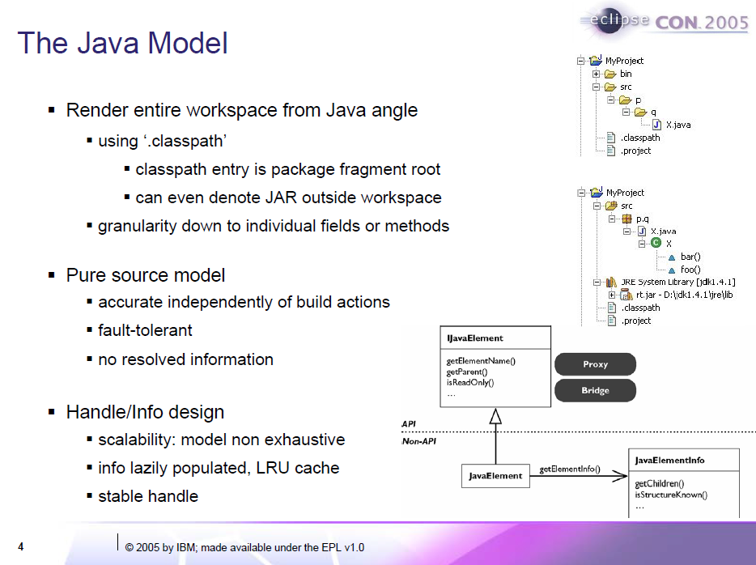

### ...and generalized it to this:
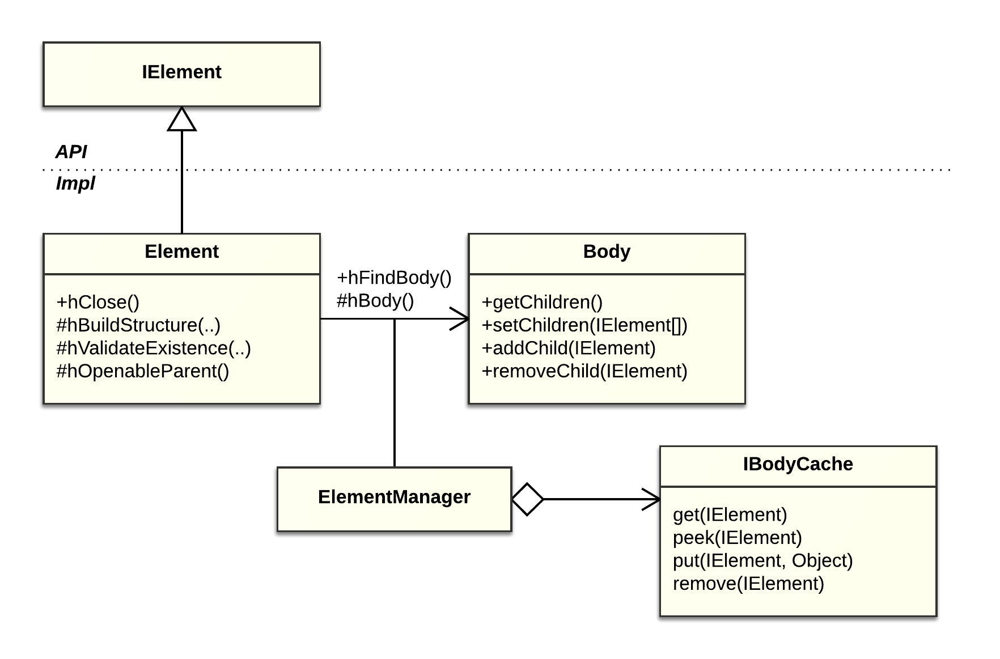

### Basic interfaces and skeletal implementations
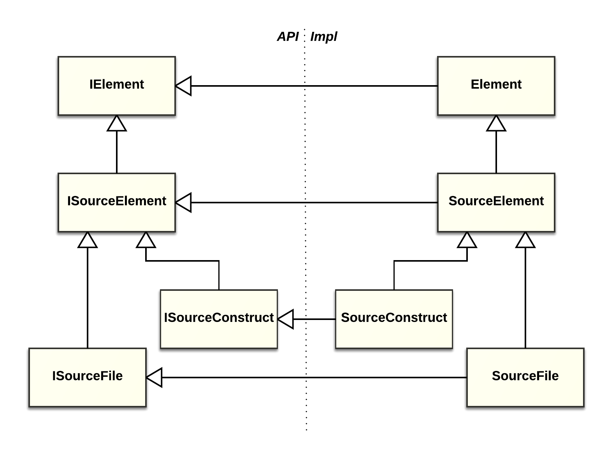

### Example: A simple model
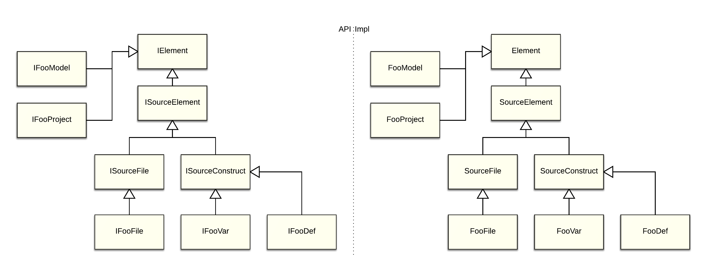
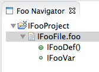

### Example: A Handly-based Java model
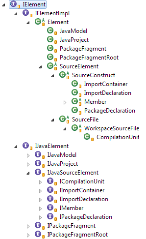

### Source Element
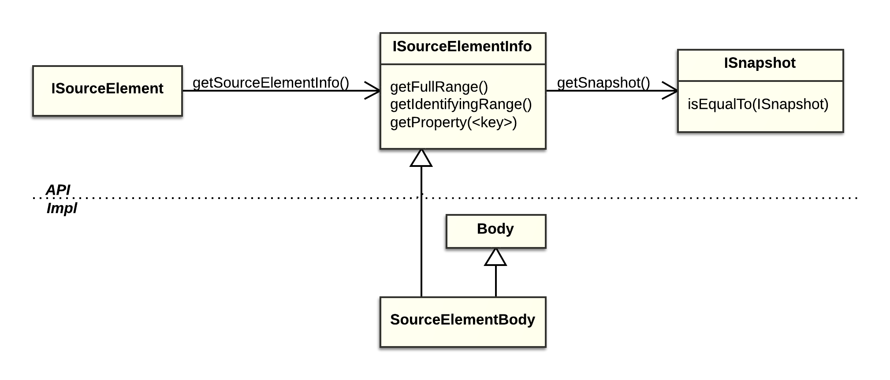

### Source File
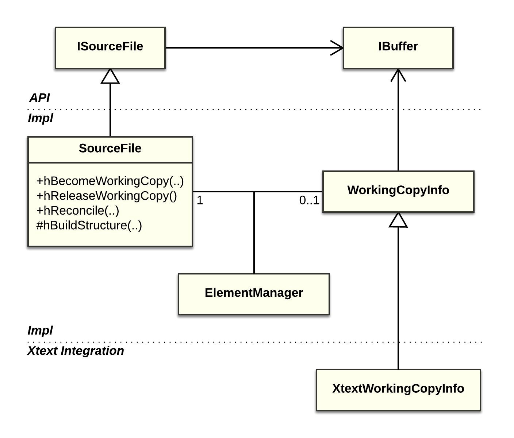

### Change notifications
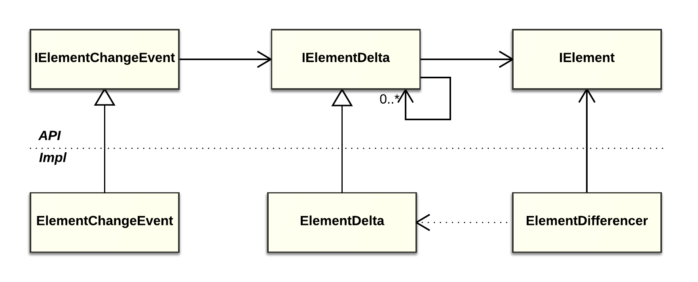

## Design goals
* Conceptual parsimony
  * Try to distill truly fundamental abstractions
* Flexibility
  * No restrictions on the shape of attainable models
  * No dependency on a specific parsing technology
  * The model implementor remains fully in charge

## Design goals
* The API should be rich enough to enable such features as:
  * Model change notifications
  * Comprehensive working copy support
  * Integration with source editors (incl. Xtext editor)
  * Common UI frameworks (Outline, Working Set, Search...)

## Design details
* Please see [Architectural Overview](http://www.eclipse.org/downloads/download.php?file=/handly/docs/handly-overview.pdf&r=1)
for more details
* Updated for Handly 0.5 or later

## Current status
* About three years in development at Eclipse
* Incubating Technology project
* Successfully used in two large-scale commercial products
  * 1C:Enterprise Development Tools
  * Codasip Studio
  * [Adopters](https://wiki.eclipse.org/Handly/Adopters) seem quite happy
* A number of exemplary implementations
  * Including a [Java model example](https://pisv.wordpress.com/2015/06/22/handly-0-3-java-model-example/)
* Comprehensive [getting started guide](https://github.com/pisv/gethandly/wiki)

## Current status
* Two major releases per year. Predictable schedule
* [Version 0.5](https://projects.eclipse.org/projects/technology.handly/releases/0.5) (June 2016, coinciding with Eclipse Neon)
  * Significant API improvents (a "2.0" release in spirit)
* [Version 0.6](https://projects.eclipse.org/projects/technology.handly/releases/0.6) (December 2016)
  * Incremental improvement of the new design introduced in 0.5
  * Special emphasis on facilities for non-breaking API evolution
  * Support for non-local file systems and files external to the workspace

## Future outlook
* Version 0.7 (June 2017, coinciding with Eclipse Oxygen)
  * More API improvements
*  Version 1.0
  * Stable API
  * Graduating from Incubation
  * Hopefully, broader adoption

## Thank you!
Any help or feedback would be greatly appreciated!
